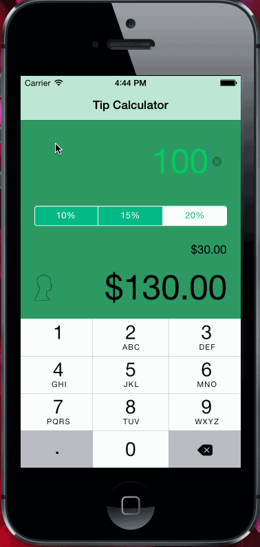

# Tip Calculator Week 1 Submission

This is an iOS 7 demo application for calculating total bill to be paid based on tip percentage along with breakdown of payment from group size varying from 1 to 4.

Time spent: 7 hours spent in total

Completed user stories:

 * [x] Required: User should be able to enter bill amount and select choice of tip percentage
 * [x] Optional: Use animation
  
Notes:

* Tried to make UI look like https://gist.github.com/timothy1ee/7747214#optional-tasks
* Spend good amount in finding a solution for an issue wherein due to animation, background color was not getting disturbed once views were moved up.

Walkthrough of all user stories:

GIF created with [LiceCap](http://www.cockos.com/licecap/).

